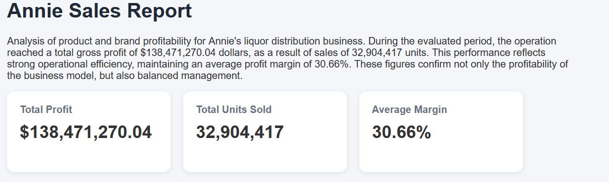
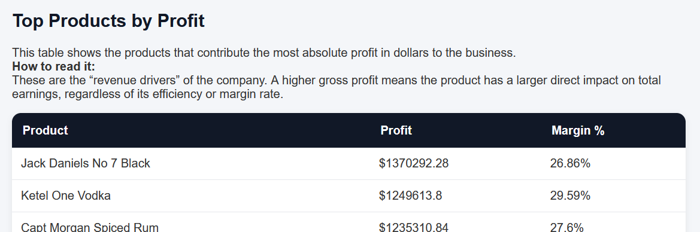
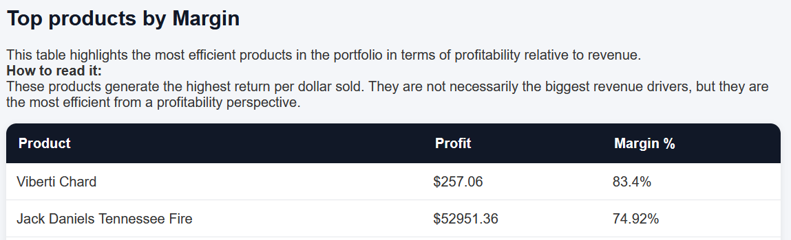
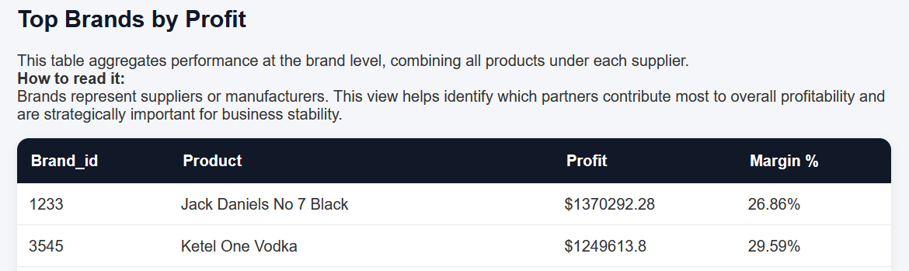
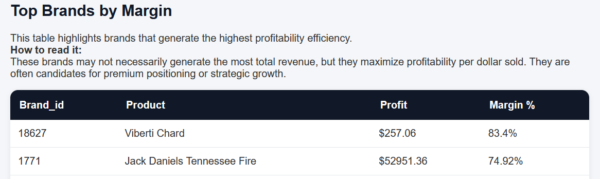
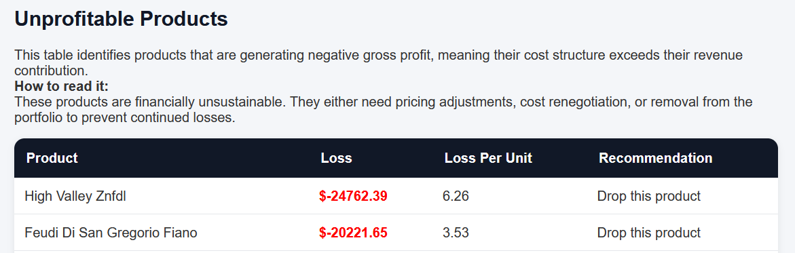

# Annie's Magic Numbers — Profitability Analytics Pipeline

## Overview

This project was developed as a solution for the Annie’s Magic Numbers Challenge.

The objective was not only to answer the business questions, but also to design a maintainable and scalable analytical pipeline capable of:

* Ingesting multiple CSV datasets.
* Cleaning and validating data.
* Calculating financial metrics.
* Generating business insights.
* Producing an automated executive report.

## Tech Stack
| Tool | Purpuse |
| :--- | :---: |
| Python | Pipeline orchestration |
| DuckDB | Analytical database engine |
| Pandas | DataFrame manipulation |
| Jinja2 | HTML report generation |
| weasyprint | PDF report generation |

## Project Architecture Diagram
```mermaid
Raw CSV Files 
        ↓ 
Staging Layer 
        ↓ 
Cleaning & Validation Layer 
        ↓ 
Analytical Mart Layer 
        ↓ 
Business Analytical Layer 
        ↓ 
Builder Report
```
## Pipeline design
### 1. Ingestion Layer
CSV files are loaded directly into staging tables in DuckDB, preserving the exact structure of the source through efficient queries.

The objective is to ensure reproducibility, leverage DuckDB’s automatic type inference, guarantee idempotency in every execution, and maintain a clear separation between raw and transformed data.

### 2. Cleaning and Validation Layer
In this phase, data is filtered and normalized to ensure quality before analysis. The process includes activities such as:

- Removing duplicate records.
- Filtering critical null values.
- Normalizing and casting data types.
- Trimming whitespace from text fields.

### 3. Analytical Mart Layer
All core business logic is centralized in the `mart_profits.sql` script. This layer is responsible for calculating the key financial metrics used for analysis.

#### Analytics Formulas

#### Average Unit Cost
```text 
Average Unit Cost = Total Purchase Dollars / Total Purchased Units
```

#### Cost of Goods Sold (COGS)
```
COGS = Average Unit Cost × Units Sold
```

#### Gross Profit
```
Gross Profit = Revenue - COGS
```

#### Gross Margin Percentage
```
Gross Margin % = Gross Profit / Revenue
```
### 4. Business Analytical Layer 
This layer calculate the main metricts for report:
* Summary metrics
* Top Products by Profit
* Top Products by Margin
* Top Brands by Profit
* Top Brands by Margin
* Unprofitable Products

### 5. Builder Report Layer
In this layer, all data generated from the Business Analytical Layer is consumed to build the final reporting outputs using an HTML template stored in `src/templates/report.html.`

The process generates both PDF and HTML reports, allowing users to visualize and analyze the complete business information in a structured format.

Output directory:
`output/`

## How run

### 1. Clone repository
```
git clone git@github.com:Abraham-LoGa/annies-liquor-sales-analysis.
cd annies-magic-numbers
```
### 2. Install dependencies
```
pip install -r requirements.txt
```
### 3. Execute pipeline
```
python main.py
```
### 4. Output
The pipeline generates:
```
output/report.html
```

## Example Report Screenshots
### Summary

### Top Products by Profit

### Top Products by Margin

### Top Brands by Profit

### Top Brands by Margin

### Unprofit Products
